<h3><code>pranjal@github ~ $ ./contributions.sh</code></h3>

 
 

<h3><code>pranjal@github ~ $ whoami</code></h3>

<table>
<tr>
<td valign="top"></td>
<td valign="top"></td>
</tr>
</table>

 
 

<h3><code>pranjal@github ~ $ ./featured.sh</code></h3>

<b>Machine Learning · Applied AI · Data Systems</b>

 

The contribution graph is generated from public GitHub data by a daily GitHub Action. No token or third-party stats service required.

